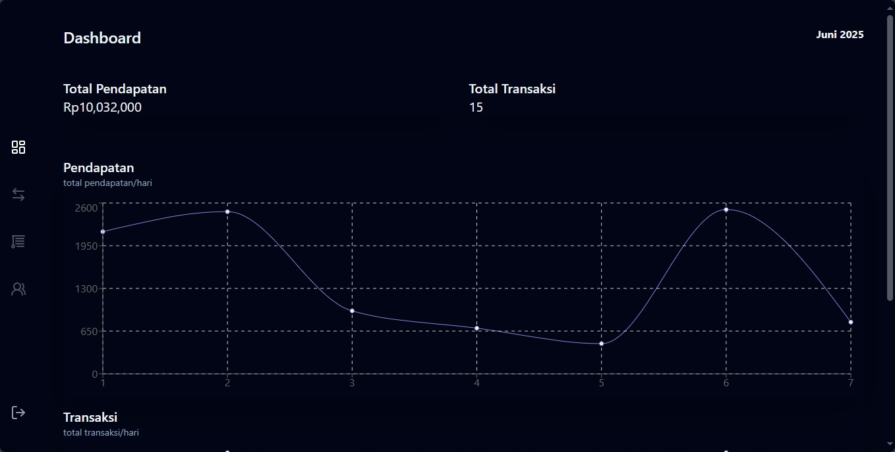
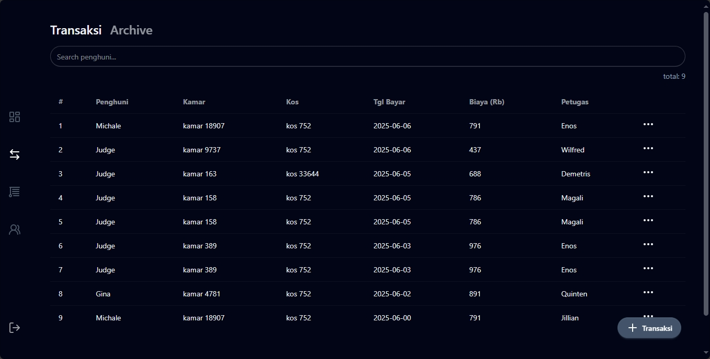
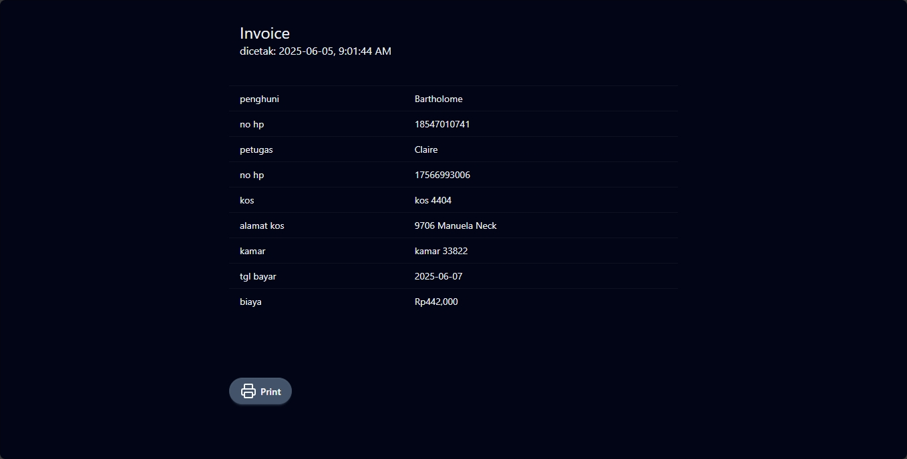
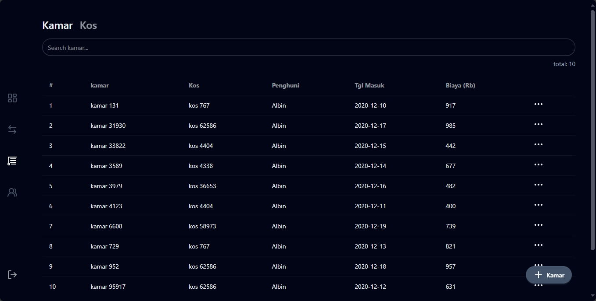

# Kos Project

management system boarding house build with react and firebase

## check demo web

[https://demo-kos.nurs.my.id](https://demo-kos.nurs.my.id)

## screenshot

<div style="overflow-x:auto; display:flex; gap: 1em">
    
    
    
    
    
    
</div>

## tech stack

- frontend
    - react
    - tailwind (styling)
    - zustand (state management)
    - swr (data fetching)

- backend / services
    - hono
    - firebase
    - cloudflare r2

- testing
    - playwright

- database
    - firestore

## feature

- login as admin
- crud kos
- crud kamar
- crud penghuni
- crud petugas
- crud transaksi
- invoice
- dashboard

## prepare and installation

**clone project**

```bash
git clone --depth 1 https://github.com/nursyah21/kos
```

**installation dependecies**

```bash
cd kos
yarn
cd api-upload
yarn
```

**prepare for firebase**

1. create project in firebase and activate firestore, and authentication
2. get service-account.json from your firebase project and place it in root folder
3. copy .env.example to .env
4. set .env based on your firebase project

note: `VITE_UPLOAD_*` based on your backend api

**prepare for cloudflare**

1. you need an custom domain for public domain your cloud storage
2. create r2 bucket and set custom domain
3. copy wrangler.jsonc.example to wrangler.jsonc
4. set all vars in wranglerc based on your cloudflare project

**deploy backend api**

in folder `api-upload`
```bash
yarn deploy
```

**seeding data**

in root folder
```bash
yarn seed:user
yarn seed 
```

## how to run

**run in development**

```bash
yarn dev
```

**run production on local**
```bash
yarn build
yarn preview
```

## tesing

**run testing**
```bash
yarn test
```

## how to run with docker

**build and up**
```bash
yarn prod:up
```

**load testing**
```bash
yarn loadtest:prod
```

**stop docker**
```bash
yarn prod:down
```

## benchmark

**sofware and hardware**
- os: windows 10
- ram: 8gb
- cpu: i5 6200u

**run load testing in preview mode**

```bash
# make sure you run it before run test
yarn preview
```

```bash
yarn loadtest:preview
```

**result preview**

- Running 10s test @ http://localhost:3000
- 200 connection
- latency
    - avg: 206ms
    - max: 436ms
    - stdev: 46.8ms
- req/s
    - avg: 963
    - min: 761
    - stdev: 135
- total 10k request in 10.25s

**run load testing in production mode**

```bash
# make sure you run it before run test
yarn prod:up
```

```bash
yarn loadtest:prod
```

**result prod**

- Running 10s test @ http://localhost:3000
- 200 connection
- latency
    - avg: 91ms
    - max: 89.27ms
    - stdev: 1819ms
- req/s
    - avg: 2,196
    - min: 574
    - stdev: 621.85
- total 22k request in 10.59s